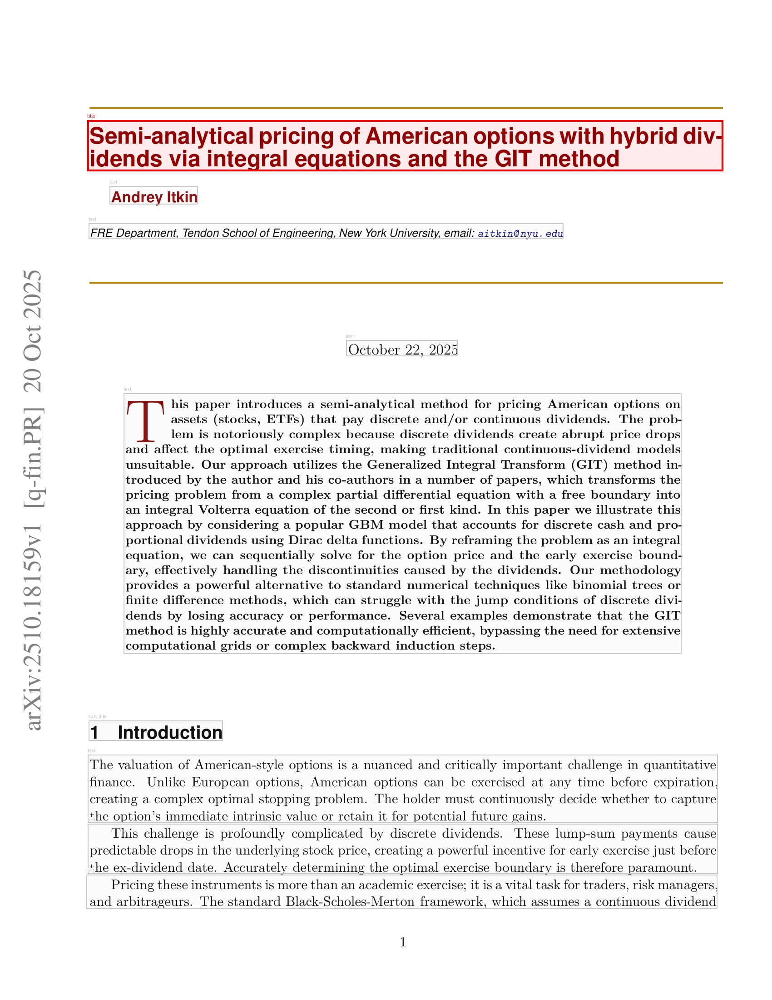
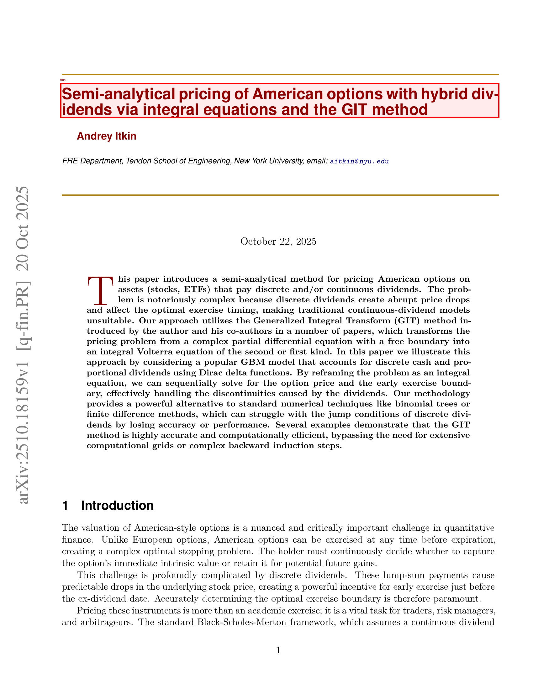
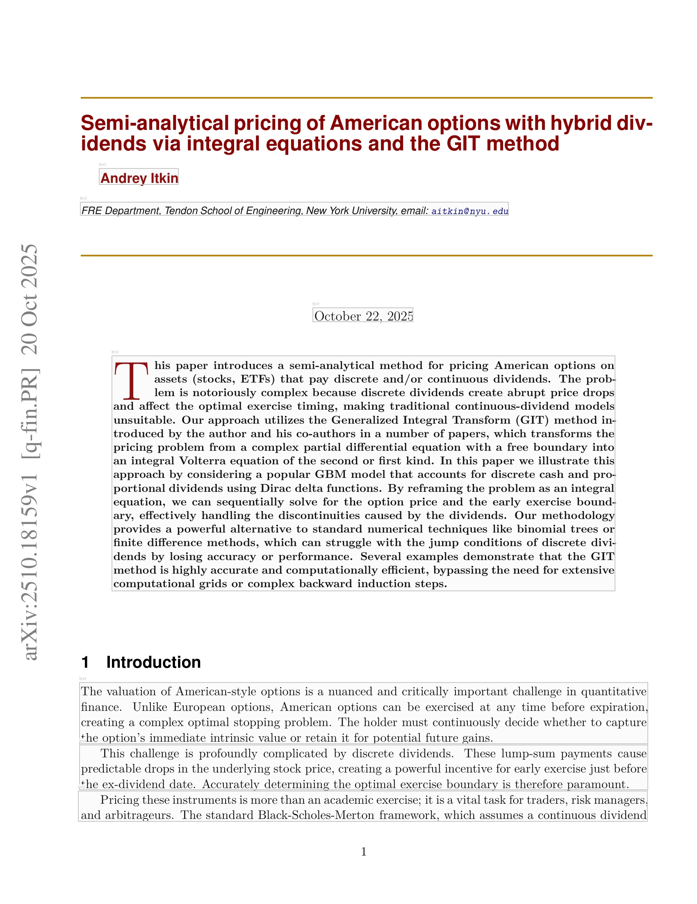
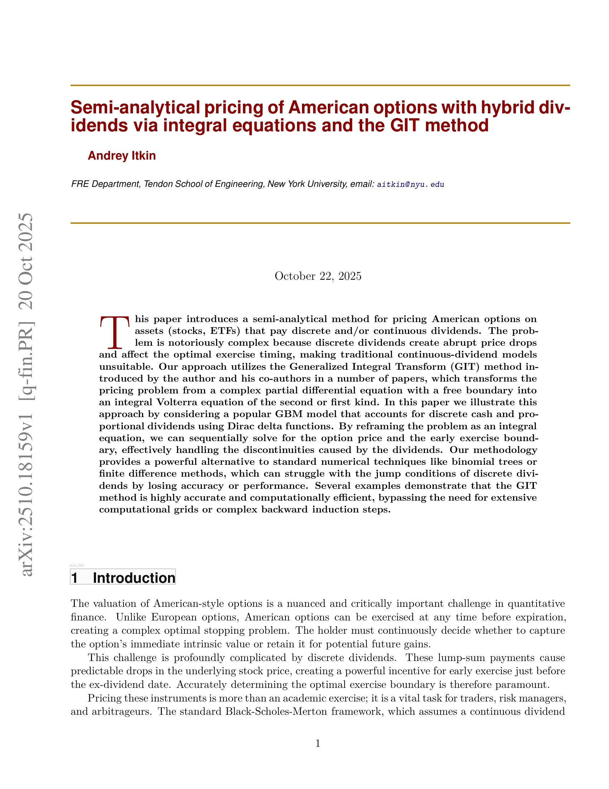
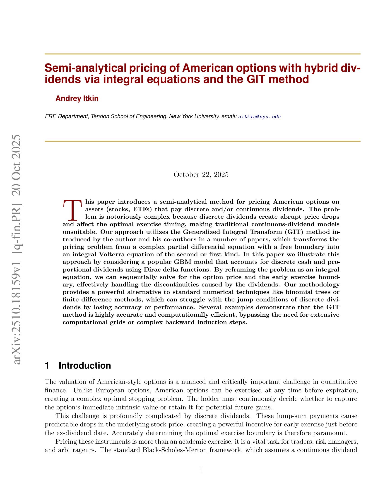
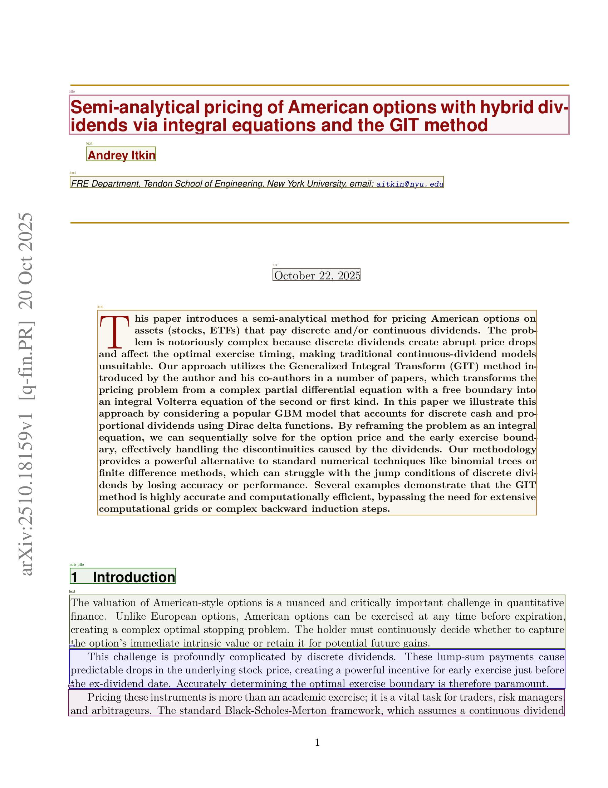
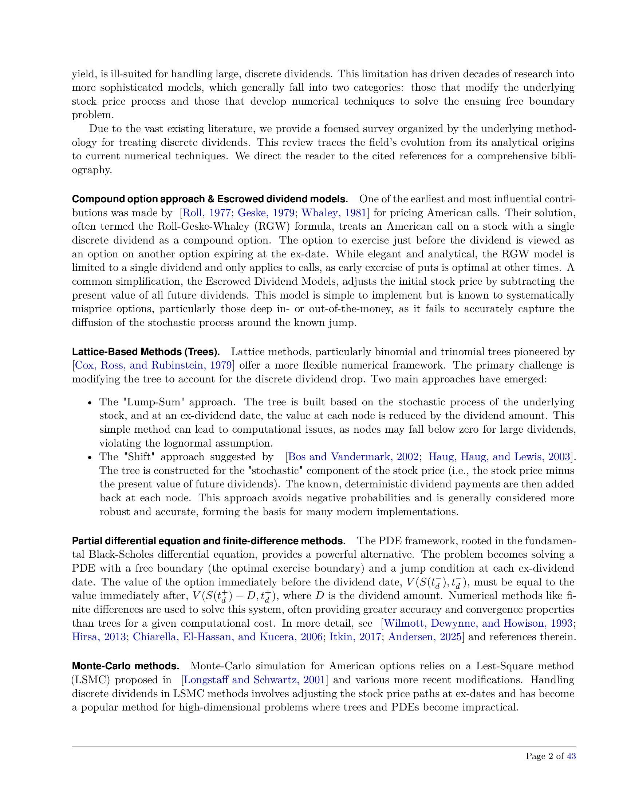
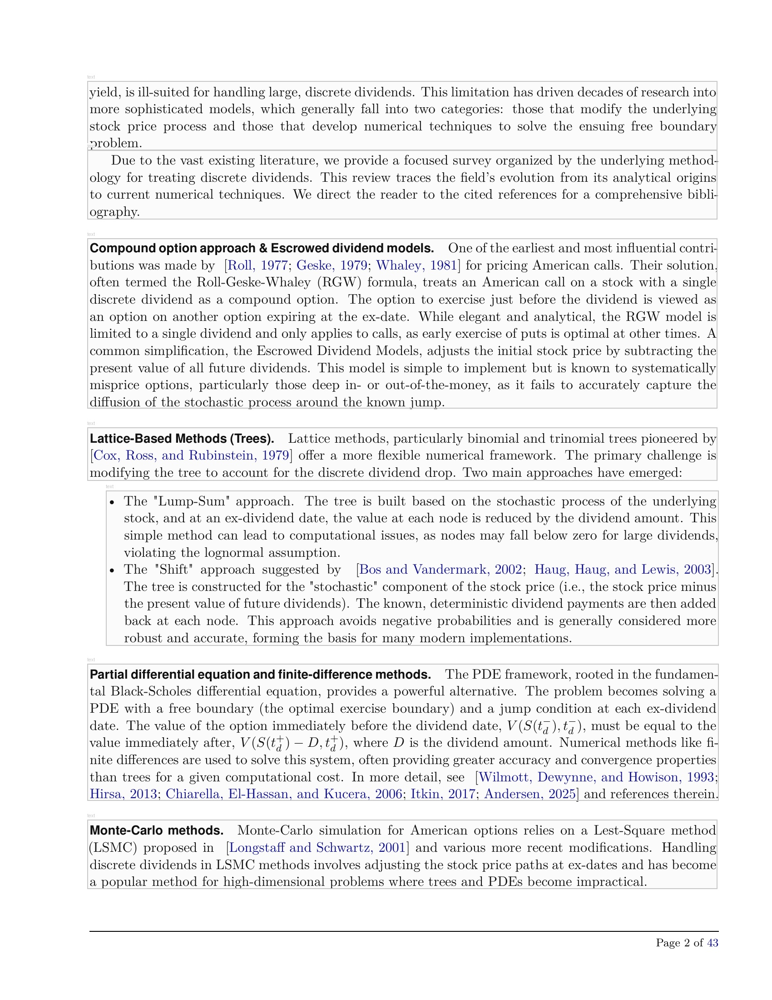

# Enhanced PDF Extraction Demo Example

This document demonstrates the **enhanced extraction capabilities** of the DeepSeek OCR CPU toolkit, showcasing the new structured element extraction, individual bounding box extraction, and type-specific visualization features introduced in Phase 2 of the enhancement plan.

## Source Document

**Paper:** "Semi-analytical pricing of American options with hybrid dividends via integral equations and the GIT method"  
**Author:** Andrey Itkin (NYU)  
**arXiv ID:** 2510.18159v1  
**Pages Processed:** 4 (of 43 total)  
**Processing Date:** October 23, 2025

## Processing Method

The PDF was processed using the **enhanced API** (`process_pdf_enhanced()`):

```bash
.venv/bin/python pdf_demo_enhanced.py
```

The enhanced processing:
1. Converts each PDF page to a high-resolution PNG image (200 DPI)
2. Runs DeepSeek OCR on each page with grounding reference extraction
3. **NEW:** Extracts individual elements (titles, text blocks, images, tables, etc.) with bounding box metadata
4. **NEW:** Generates type-specific visualization overlays (titles only, text only, all types colored, etc.)
5. **NEW:** Saves each element as a separate image file with JSON metadata
6. Generates per-page outputs with comprehensive structural information

## Enhanced Output Structure

```
enhanced_pdf_demo_output/
├── pages/                              # Rendered page images (unchanged)
│   ├── page_0001.png
│   ├── page_0002.png
│   └── ...
├── page_0001/                          # Per-page OCR results
│   ├── result.mmd                      # Extracted markdown (unchanged)
│   ├── result_raw.txt                  # NEW: Raw model output with grounding references
│   ├── result_with_boxes.jpg           # Annotated page with bounding boxes (unchanged)
│   ├── elements/                       # NEW: Individual element extractions
│   │   ├── page_0001_elem_0000_title.jpg       # Title element image
│   │   ├── page_0001_elem_0000_title.json      # Element metadata JSON
│   │   ├── page_0001_elem_0001_text.jpg        # Text block image
│   │   ├── page_0001_elem_0001_text.json       # Text metadata
│   │   └── ...
│   ├── overlays/                       # NEW: Type-specific visualizations
│   │   ├── title_only.jpg              # Only title bounding boxes
│   │   ├── text_only.jpg               # Only text bounding boxes
│   │   ├── sub_title_only.jpg          # Only subtitle bounding boxes
│   │   └── all_types_colored.jpg       # All types with color coding
│   └── images/                         # Extracted figures (if any)
├── page_0002/
│   └── ... (same structure)
└── ...
```

## Key New Features

### 1. Individual Element Extraction

Every detected document element is now extracted as a **separate image file** with associated **JSON metadata**:

**Example: Title Element**


**Metadata (`page_0001_elem_0000_title.json`):**
```json
{
  "element_id": "page_0001_elem_0000",
  "type": "title",
  "page": 1,
  "index": 0,
  "bounding_boxes": [
    {
      "x1": 192,
      "y1": 264,
      "x2": 1592,
      "y2": 376
    }
  ],
  "bounding_boxes_normalized": [
    {
      "x1": 0.113,
      "y1": 0.120,
      "x2": 0.936,
      "y2": 0.171
    }
  ],
  "metrics": {
    "num_boxes": 1,
    "total_area": 156800,
    "width": 1400,
    "height": 112,
    "aspect_ratio": 12.5
  },
  "image_dimensions": {
    "width": 1700,
    "height": 2200
  },
  "cropped_image": {
    "filename": "page_0001_elem_0000_title.jpg",
    "width": 1400,
    "height": 112,
    "padding": 0
  }
}
```

### 2. Type-Specific Visualization Overlays

**All Types Color-Coded:**


**Title Elements Only:**


**Text Elements Only:**


**Subtitle Elements Only:**


**Color Scheme:**
- **Title** - Red
- **Subtitle** - Purple
- **Text/Paragraph** - Green
- **Image** - Blue
- **Table** - Orange
- **Equation** - Magenta
- **Caption** - Cyan
- **List** - Yellow

### 3. Raw Model Output Preservation

The raw model output with grounding references is now saved as `result_raw.txt`, enabling post-processing and analysis:

**Format:**
```
<|ref|>title<|/ref|><|det|>[[192, 264, 1592, 376]]<|/det|>
# Semi-analytical pricing of American options...

<|ref|>text<|/ref|><|det|>[[192, 416, 1592, 768]]<|/det|>
Andrey Itkin
FRE Department, Tendon School of Engineering...
```

### 4. Structured Element Information

Each element includes comprehensive metadata:

- **Element ID:** Unique identifier (`page_NNNN_elem_NNNN`)
- **Type:** Element classification (title, text, image, table, etc.)
- **Page Number:** Source page
- **Bounding Boxes:** Both absolute pixel coordinates and normalized [0,1] coordinates
- **Metrics:** Width, height, area, aspect ratio, number of boxes
- **Image Dimensions:** Original page dimensions for coordinate reference

## Sample Results

### Page 1: Title and Abstract

**Source Page:**


**Extracted Markdown (excerpt):**

```markdown
# Semi-analytical pricing of American options with hybrid dividends via integral equations and the GIT method

Andrey Itkin

FRE Department, Tendon School of Engineering, New York University, email: aitkin@nyu.edu

October 22, 2025

This paper introduces a semi-analytical method for pricing American options on 
assets (stocks, ETFs) that pay discrete and/or continuous dividends. The problem 
is notoriously complex because discrete dividends create abrupt price drops and 
affect the optimal exercise timing, making traditional continuous-dividend models 
unsuitable...
```

**Enhanced Element Extraction:**
- **1 Title element** (main heading)
- **1 Subtitle element** (author information)
- **7 Text elements** (abstract and introduction paragraphs)

**With All Bounding Boxes:**


---

### Page 2: Introduction and Literature Review

**Source Page:**


**Extracted Content (excerpt):**

```markdown
yield, is ill-suited for handling large, discrete dividends. This limitation has 
driven decades of research into more sophisticated models, which generally fall 
into two categories: those that modify the underlying stock price process and 
those that develop numerical techniques to solve the ensuing free boundary problem.

Due to the vast existing literature, we provide a focused survey organized by 
the underlying methodology for treating discrete dividends...

## Compound option approach & Escrowed dividend models

One of the earliest and most influential contributions was made by 
[Roll, 1977; Geske, 1979; Whaley, 1981] for pricing American calls...
```

**Enhanced Element Extraction:**
- **7 Text elements** (various paragraphs and sections)

**Type-Specific Visualization:**

The text overlay shows all text blocks clearly delineated:


---

## Document Statistics

### Processing Summary

- **Total Pages Processed:** 4
- **Total Elements Extracted:** 22
- **Element Type Distribution:**
  - Title: 1
  - Subtitle: 1
  - Text: 20
  - Images: 0 (in processed pages)
  - Tables: 0 (in processed pages)
  - Equations: 0 (in processed pages)

### Element Breakdown by Page

| Page | Title | Subtitle | Text | Total |
|------|-------|----------|------|-------|
| 1    | 1     | 1        | 7    | 9     |
| 2    | 0     | 0        | 7    | 7     |
| 3    | 0     | 0        | 6    | 6     |
| 4    | 0     | 0        | 0    | 0     |

## Use Cases Enabled by Enhanced Extraction

### 1. Fine-Grained Element Analysis
Extract and analyze individual elements without processing entire pages:
```python
from pathlib import Path
import json

# Load element metadata
with open("page_0001/elements/page_0001_elem_0000_title.json") as f:
    title_data = json.load(f)

print(f"Title dimensions: {title_data['metrics']['width']}x{title_data['metrics']['height']}")
print(f"Title aspect ratio: {title_data['metrics']['aspect_ratio']}")
```

### 2. Type-Based Filtering
Process only specific element types (e.g., extract all titles across document):
```python
# Find all title elements
import glob
title_files = glob.glob("page_*/elements/*_title.json")
for title_file in title_files:
    # Process title element
    pass
```

### 3. Training Data Generation
Use extracted elements for machine learning:
- Element images for visual recognition training
- Bounding boxes for layout analysis models
- Type labels for document classification

### 4. Quality Assessment
Analyze element metrics to assess extraction quality:
```python
# Check for suspiciously small or large elements
if title_data['metrics']['width'] < 100:
    print("Warning: Title seems too narrow")
if title_data['metrics']['aspect_ratio'] > 20:
    print("Warning: Unusual aspect ratio")
```

### 5. Document Structure Analysis
Build document hierarchy from element metadata:
```python
# Group elements by type and position
elements_by_type = {}
for elem_file in glob.glob("page_*/elements/*.json"):
    with open(elem_file) as f:
        elem = json.load(f)
        elem_type = elem['type']
        elements_by_type.setdefault(elem_type, []).append(elem)
```

## Comparison: Standard vs. Enhanced Processing

| Feature | Standard Processing | Enhanced Processing |
|---------|---------------------|---------------------|
| Markdown Output | ✓ | ✓ |
| Annotated Image | ✓ (all boxes) | ✓ (all boxes) |
| Figure Extraction | ✓ (images only) | ✓ (images only) |
| Individual Element Images | ✗ | ✓ **NEW** |
| Element Metadata JSON | ✗ | ✓ **NEW** |
| Type-Specific Overlays | ✗ | ✓ **NEW** |
| Raw Grounding References | ✗ | ✓ **NEW** |
| Bounding Box Coordinates | ✗ | ✓ **NEW** |
| Element Metrics | ✗ | ✓ **NEW** |
| Backward Compatible | N/A | ✓ |

## Performance Notes

- **Processing Time:** ~45 seconds per page on CPU (same as standard processing)
- **Storage Overhead:** ~2-5 MB per page for element images and metadata
- **Memory Usage:** ~8 GB RAM during processing (same as standard)
- **Backward Compatibility:** Original `process_pdf()` function unchanged; use `process_pdf_enhanced()` for new features

## API Usage

### Enhanced PDF Processing

```python
from inference import process_pdf_enhanced

result = process_pdf_enhanced(
    pdf_path="document.pdf",
    output_dir="output/",
    generate_overlays=True,
    save_elements=True,
)

# Access per-page results
for page in result['pages']:
    print(f"Page {page['page_number']}: {len(page['elements'])} elements")
    
    # Access element data
    for elem in page['elements']:
        print(f"  - {elem['type']}: {elem['metrics']['width']}x{elem['metrics']['height']}")
    
    # Access element image paths
    for elem_id, path in page['element_paths'].items():
        print(f"  - {elem_id} → {path}")
```

### Query Elements

```python
# Find all titles
titles = []
for page in result['pages']:
    titles.extend([e for e in page['elements'] if e['type'] == 'title'])

print(f"Found {len(titles)} titles")

# Find large text blocks
large_text = []
for page in result['pages']:
    large_text.extend([
        e for e in page['elements'] 
        if e['type'] == 'text' and e['metrics']['total_area'] > 100000
    ])

print(f"Found {len(large_text)} large text blocks")
```

## Accessing Full Results

All enhanced output files are available in `docs/examples/enhanced_pdf_demo_output/`:
- Per-page markdown: `page_NNNN/result.mmd`
- Annotated pages: `page_NNNN/result_with_boxes.jpg`
- Raw model output: `page_NNNN/result_raw.txt` **(NEW)**
- Individual elements: `page_NNNN/elements/*.jpg` and `*.json` **(NEW)**
- Type overlays: `page_NNNN/overlays/*.jpg` **(NEW)**

## Next Steps

The enhanced extraction system provides the foundation for:

### Phase 3: Structured Output (Planned)
- Document-level JSON structure with hierarchical relationships
- Schema validation for element metadata
- Document statistics and analysis

### Phase 4: Linking System (Planned)
- Image manifest with contextual information
- Cross-reference resolution (e.g., "Figure 1" → actual image)
- Context extraction for elements

### Phase 5: Advanced Features (Planned)
- Element classification and enrichment
- Reading order detection
- Semantic relationship mapping

---

**For more information on enhanced PDF processing, see:**
- [Enhanced Extraction Quickstart](ENHANCED_EXTRACTION_QUICKSTART.md)
- [PDF Processing Guide](PDF_PROCESSING_GUIDE.md)
- [Implementation Summary](reference/IMPLEMENTATION_SUMMARY.md)
- [Enhancement Plan](plans/pdf_extraction_enhancement_plan.md)
