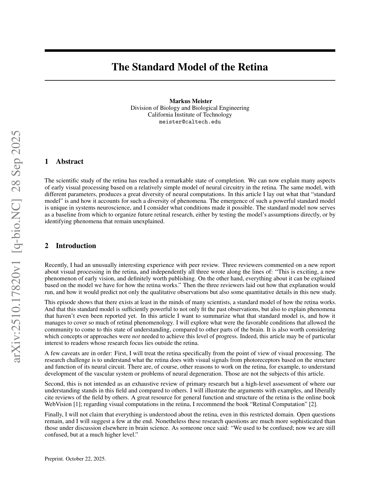
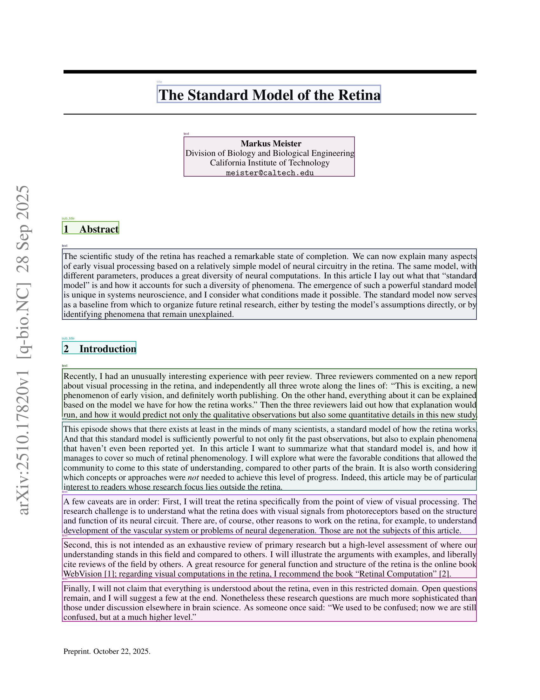
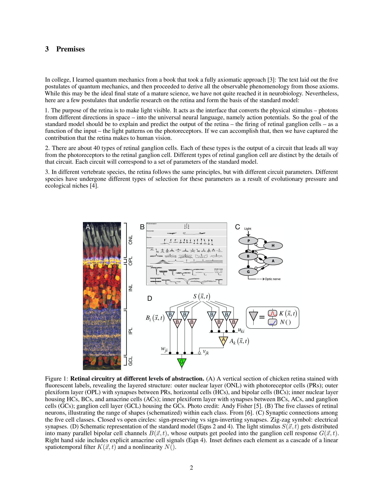
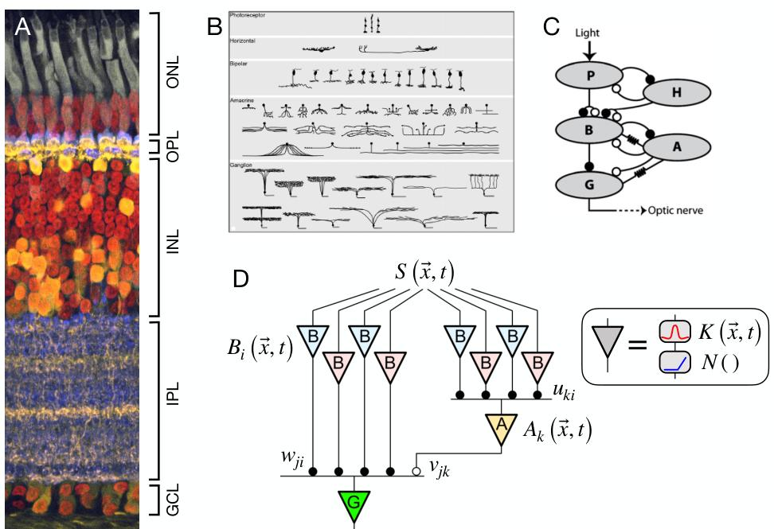
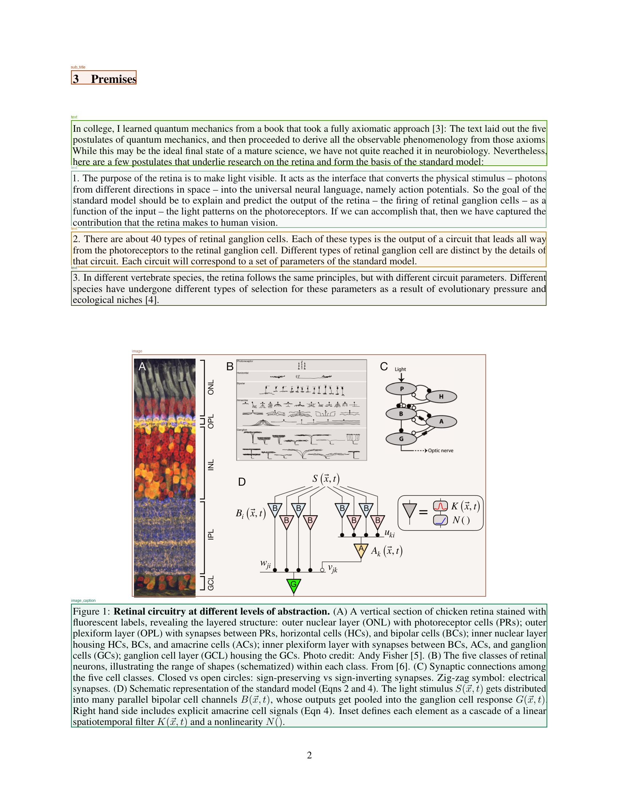
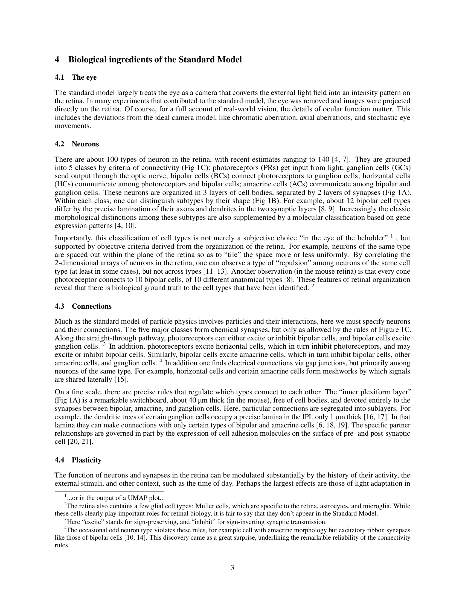

# PDF OCR Demo Example

This document demonstrates the output of the DeepSeek OCR CPU toolkit when processing a multi-page PDF document.

## Source Document

**Paper:** "The Standard Model of the Retina" by Markus Meister  
**arXiv ID:** 2510.17820v1  
**Pages:** 16  
**Processing Date:** 2025-10-22

## Processing Method

The PDF was processed using the `pdf_demo.py` script:

```bash
.venv/bin/python pdf_demo.py
```

The script:
1. Converts each PDF page to a high-resolution PNG image (200 DPI)
2. Runs DeepSeek OCR on each page independently
3. Extracts markdown text, preserves document structure, and identifies embedded images/figures
4. Generates per-page outputs with bounding box visualizations
5. Combines all pages into a single markdown document

## Output Structure

```
examples/pdf_demo_output/
├── 2510.17820v1.md           # Combined markdown for all pages
├── pages/                     # Rendered page images
│   ├── page_0001.png
│   ├── page_0002.png
│   └── ...
├── page_0001/                 # Per-page OCR results
│   ├── result.mmd             # Extracted markdown
│   ├── result_with_boxes.jpg  # Annotated page with bounding boxes
│   └── images/                # Extracted figure images
├── page_0002/
│   ├── result.mmd
│   ├── result_with_boxes.jpg
│   └── images/
│       └── 0.jpg              # Figure 1 from the paper
└── ...
```

## Sample Results

### Page 1: Title and Abstract

**Source Page:**


**Extracted Markdown (excerpt):**

```markdown
# The Standard Model of the Retina

Markus Meister  Division of Biology and Biological Engineering  
California Institute of Technology  meister@caltech.edu

## 1 Abstract

The scientific study of the retina has reached a remarkable state of completion. 
We can now explain many aspects of early visual processing based on a relatively 
simple model of neural circuitry in the retina. The same model, with different 
parameters, produces a great diversity of neural computations...
```

**With Bounding Boxes:**


---

### Page 2: Figures and Structured Content

**Source Page:**


**Extracted Content:**

The OCR successfully identified and extracted Figure 1 from the document:

**Extracted Figure:**


**Extracted Caption:**

```markdown
<center>Figure 1: Retinal circuitry at different levels of abstraction. 
(A) A vertical section of chicken retina stained with fluorescent labels, 
revealing the layered structure: outer nuclear layer (ONL) with photoreceptor 
cells (PRs); outer plexiform layer (OPL) with synapses between PRs, horizontal 
cells (HCs), and bipolar cells (BCs)...</center>
```

**With Bounding Boxes:**


---

### Page 3: Mathematical Equations

**Source Page:**


**Extracted Markdown (excerpt):**

```markdown
## 5 The response function of ganglion cells in the standard model

Mathematically, one can formulate the model as follows. We start with the 
visually driven input experienced by a bipolar cell of type $i$ located at 
position $\vec{x}$ on the retina:

$$B_{i}(\vec{x},t) = \int_{\vec{x}^{\prime},t^{\prime}}K_{i}\left(\vec{x}^{\prime} - \vec{x},t^{\prime} - t\right)S\left(\vec{x}^{\prime},t^{\prime}\right)\mathrm{d}^{2}x^{\prime}\mathrm{d}t^{\prime}$$

where $S\left(\vec{x}^{\prime},t^{\prime}\right)$ is the light stimulus at 
point $\vec{x}^{\prime}$ and time $t^{\prime}$.
```

---

## Key Capabilities Demonstrated

1. **Document Structure Preservation**
   - Hierarchical headings (H1, H2, H3)
   - Paragraph breaks and text flow
   - List formatting (numbered and bulleted)

2. **Mathematical Content**
   - LaTeX equations (inline and display)
   - Greek symbols and special characters
   - Complex mathematical notation

3. **Figure Detection and Extraction**
   - Automatic detection of embedded images
   - Figure extraction with bounding boxes
   - Caption association

4. **Layout Analysis**
   - Column detection
   - Section boundaries
   - Visual element positioning (titles, subtitles, text blocks)

5. **Bounding Box Visualization**
   - Color-coded regions by type (title, text, image, etc.)
   - Per-page annotated images showing detected regions
   - Coordinates normalized to page dimensions

## Performance Metrics

- **Processing Time:** ~45 seconds per page on CPU (AMD Ryzen)
- **Compression Ratio:** ~1.1 (output tokens / valid image tokens)
- **Model:** DeepSeek-OCR with CPU-optimized inference
- **Memory Usage:** ~8 GB RAM during processing

## Accessing Full Results

All output files are available in `docs/examples/pdf_demo_output/`:
- Combined markdown: `2510.17820v1.md`
- Individual page results: `page_NNNN/result.mmd`
- Annotated pages: `page_NNNN/result_with_boxes.jpg`
- Extracted figures: `page_NNNN/images/*.jpg`

## Notes on Quality

The OCR successfully:
- ✓ Extracted all text content with high accuracy
- ✓ Preserved mathematical notation and LaTeX formatting
- ✓ Identified document structure (sections, headings)
- ✓ Detected and extracted figures with captions
- ✓ Maintained paragraph flow and text organization

Minor limitations observed:
- Some complex multi-column layouts may require manual review
- Very small text or degraded image quality can affect accuracy
- Mathematical notation with unusual symbols may need verification

---

**For more information on running PDF OCR demos, see the main [README.md](../README.md#running-the-pdf-demo).**
